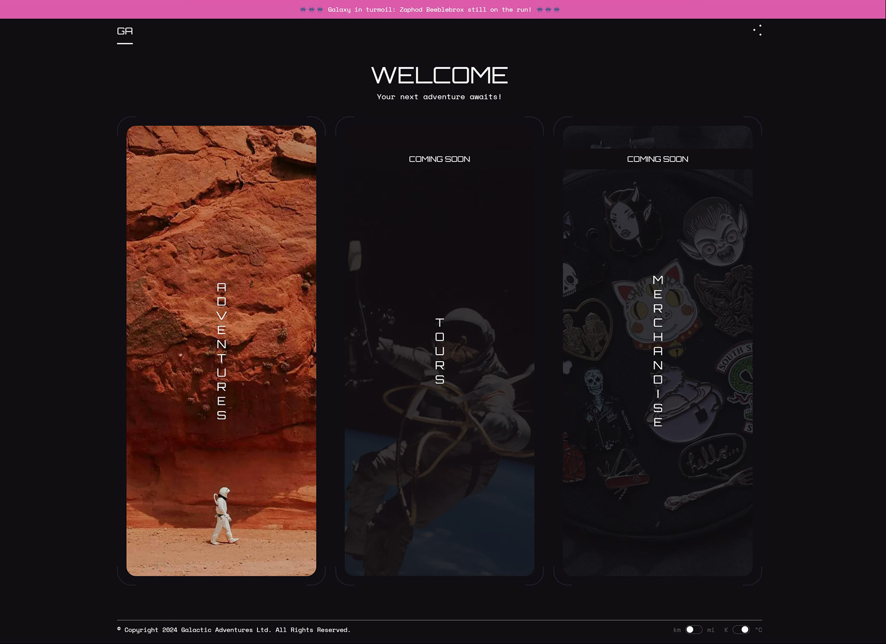
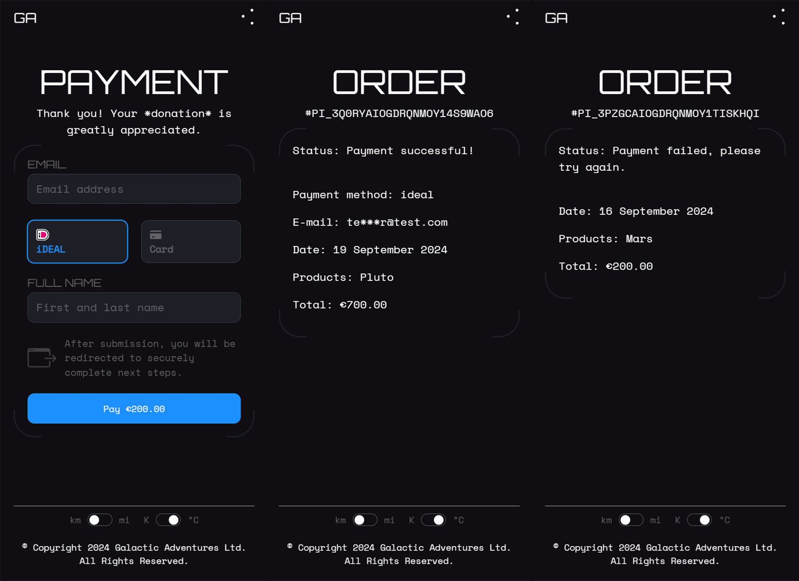

# Galactic Adventures - Client

Implementation of a React client using Tanstack Query and Axios for HTTP requests, Zustand as state manager and Stripe for payments.

## Table of contents

- [Intro](#intro)
- [Demo](#demo)
- [Features (done)](#features-done)
- [Features (TBA)](#features-tba)
- [Technologies](#technologies)
- [Data fetching & cache](#data-fetching--cache)
- [Getting started](#getting-started)
- [Resources](#resources)
- [License](#license)

## Intro

Sibling repo of [Galactic Adventures - Server](https://github.com/wolfpilot/galactic-adventures-server), make sure you check both out!

_To the stars and beyond!_

Pick a destination, anywhere in this Universe you can think of, and go! We, at Galactic Adventures, promise you will get there. Returns not guaranteed; untimely demise possible; T&Cs may apply (please read smallprint).

GA is a fictional app where you can book adventures or guided tours, purchase merchandise and more. Due to the ever-increasing scope of this project, I have limited myself to just building the Adventures flow for now, although it is more than ready to scale to encompass new features.



## Demo

**IMPORTANT**: Please have patience as **the first request may take up to one minute**.
That's because on Render's free hosting plans the servers spin down after 15 minutes of inactivity.

- Homepage: [https://wolfpilot-galactic-adventures-client.onrender.com/](https://wolfpilot-galactic-adventures-client.onrender.com/)
- Adventure - The Solar System: [https://wolfpilot-galactic-adventures-client.onrender.com/adventures?waypointId=4](https://wolfpilot-galactic-adventures-client.onrender.com/adventures?waypointId=4)
- Payment: [https://wolfpilot-galactic-adventures-client.onrender.com/payment?productType=adventure&productId=3](https://wolfpilot-galactic-adventures-client.onrender.com/payment?productType=adventure&productId=3)
- Order - Successful: [https://wolfpilot-galactic-adventures-client.onrender.com/order?payment_intent=pi_3Q0rb3IOgdrQNMoY1YNx5MrS&payment_intent_client_secret=pi_3Q0rb3IOgdrQNMoY1YNx5MrS_secret_b2iXvmMe95Wppy1HOONfDP7Tc&redirect_status=succeeded](https://wolfpilot-galactic-adventures-client.onrender.com/order?payment_intent=pi_3Q0rb3IOgdrQNMoY1YNx5MrS&payment_intent_client_secret=pi_3Q0rb3IOgdrQNMoY1YNx5MrS_secret_b2iXvmMe95Wppy1HOONfDP7Tc&redirect_status=succeeded)
- Order - Failed: [https://wolfpilot-galactic-adventures-client.onrender.com/order?payment_intent=pi_3Q3EE5IOgdrQNMoY1nO34WCu&payment_intent_client_secret=pi_3Q3EE5IOgdrQNMoY1nO34WCu_secret_Kq41jt4XehfGrnRh0IIVVh3De&redirect_status=failed](https://wolfpilot-galactic-adventures-client.onrender.com/order?payment_intent=pi_3Q3EE5IOgdrQNMoY1nO34WCu&payment_intent_client_secret=pi_3Q3EE5IOgdrQNMoY1nO34WCu_secret_Kq41jt4XehfGrnRh0IIVVh3De&redirect_status=failed)
- Error - 404: [https://wolfpilot-galactic-adventures-client.onrender.com/404](https://wolfpilot-galactic-adventures-client.onrender.com/404)



## Features (done)

- Architecture

  - React Router page navigation
  - React Router loaders
  - React Query retrieve cached result or fetch new

- State management

  - Individual stores for app, payment and persistent layer
  - Persisting user preferences across refreshes

- UI & UX

  - Overlay loader screen
  - Progressive (pixelated) image loader
  - Distance and temperature unit switch
  - Cookie banner

- Accessibility

  - Motion preference media queries
  - ESC to close site nav
  - Hover over site news banner to pause
  - Fully-TAB navigable

- Config

  - Import path aliases using tsconfig-paths

- QOL (Quality of Life)

  - Debug React Query
    - Add `debugReactQuery=true` param to any URL (excl. production)
  - Debug visual grid
    - Add `debugGrid=true` param to any URL

## Features (TBA)

- [x] Custom Stripe Elements form
- [ ] Dynamic price per distance travelled
- [ ] New products: merchandise and tours
- [ ] User auth form and dashboard
- [ ] Site-wide keyword search
- [ ] Flight configuration: spaceship, options, date

## Technologies

- Languages
  - [TypeScript](https://www.typescriptlang.org/)
- Framework
  - [React](https://react.dev/)
- Payment
  - [Stripe](https://stripe.com/)
- Config
  - [tsconfig-paths](https://www.npmjs.com/package/tsconfig-paths)
- Linting & formatting
  - [EsLint](https://eslint.org/)
  - [Prettier](https://prettier.io/)
- State management
  - [Zustand](https://zustand-demo.pmnd.rs/)
- Async
  - [Tanstack Query](https://tanstack.com/query/v3)
  - [Axios](https://axios-http.com/)
- Testing
  - [Vitest](https://vitest.dev/)
  - [RTL](https://testing-library.com/)
  - [Postman](https://www.postman.com/)
- CI/CD
  - [Husky](https://www.npmjs.com/package/husky)
    - Pre-commit
    - Pre-push
  - [Render](https://www.render.com/)
    - Hosting static webapp
  - [Cloudinary](https://cloudinary.com/)
    - Hosting media files
    - API for transforms, optimisations & delivery

## Data Fetching & Cache

### Strategies

As most of the webapp deals with fetching page-level data, I will focus on this. There are three types of pages:

1. Static: [Home](https://wolfpilot-galactic-adventures-client.onrender.com/), [Error](https://wolfpilot-galactic-adventures-client.onrender.com/404)

   These pages only fetch and display some static data, like photos and videos.

   Since most people will follow a Home -> Adventure -> Adventure Details flow, I've taken the decision to still render a loader as to not have the Homepage load instantly, and only then show a loader on the next page. That would be weird.

2. Dynamic w. loader: [Adventures](https://wolfpilot-galactic-adventures-client.onrender.com/adventures?waypointId=9), [Adventures Details](https://wolfpilot-galactic-adventures-client.onrender.com/adventures/3)

   Here, the data will be fetched dynamically based on the ID being requested. Given that the data is critical for the page content to be shown at all, any failure to fetch said data will result in a redirect to the Error page.

3. Dynamic w. fetching on mount: [Payment](https://wolfpilot-galactic-adventures-client.onrender.com/payment?productType=adventure&productId=1), [Order](https://wolfpilot-galactic-adventures-client.onrender.com/order?payment_intent=pi_3PzlrLIOgdrQNMoY0sOvhWUX&payment_intent_client_secret=pi_3PzlrLIOgdrQNMoY0sOvhWUX_secret_ryPWt7zbK5Ps8sXZtZMbZUP91&redirect_status=succeeded)

   Any pages to do with the payment flow have to be wrapped in the Stripe Provider so that the payment, customer and order data is available during render.

   Unfortunately this cannot be achieved via loaders because Stripe has to be consumed via the `useStripe` hook, while the loaders are pure functions and thus cannot consume hooks. Any data, particularly one that is dependent on Stripe, has to be fetched after the `Stripe` object has been initialised.

### Page Transitions

A side benefit of the global loader is that content can be faded in and out depending on whether data is fetching.

To make the whole experience nicer for the user, the `Loading...` text animation will only show when a fetch request has lasted more than an arbitrary amount (in our case, 500ms) to not have it pop in and out for every single route change should the reqeust be fast enough.

## Getting started

### Requirements

- [Pnpm](https://pnpm.io/) (built on v9.1.4)

### Installation

```bash
$ git clone https://github.com/wolfpilot/galactic-adventures-client.git
$ cd galactic-adventures-client
$ pnpm install
```

### Steps

```bash
# 1. Update your env config, see .env.example for guidance.

# 2. Run the API service
$ pnpm start:dev
```

## Resources

### Guides

- Setting up the PITA that is [React Query meets React Router](https://tkdodo.eu/blog/react-query-meets-react-router)
- Official docs for creating a [Custom Stripe Payment Flow](https://docs.stripe.com/payments/quickstart)

### Credits

- Data sourced from [NASA](https://science.nasa.gov/), [Wikipedia](https://en.wikipedia.org/) and a dozen others
- Photography and generated image credits go to [NASA](https://science.nasa.gov/)
- SVG icons credits go to [halfmage](https://www.svgrepo.com/collection/pixelarticons-interface-icons/) on SVGRepo
- Custom cursor credits go to [nightklp](http://www.rw-designer.com/cursor-set/space-theme) on RealWorld Graphics

## License

This project is licensed under the [MIT License](LICENSE).
